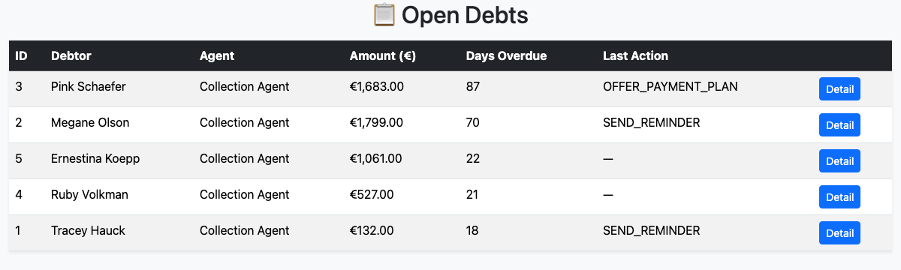
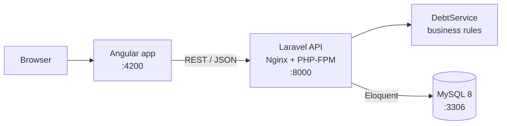
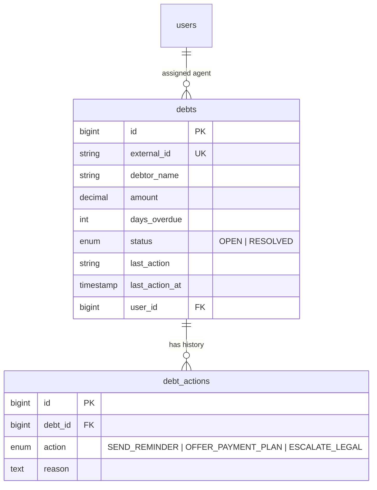

# JustSolve · Debt Action Management


A full stack app that helps a collection agent decide **what to do next on each overdue debt**.
The backend applies business rules to suggest the right action (reminder, payment plan or legal escalation), and the agent confirms it with one click. Every action is stored with its reason, so each debt keeps a full history.

I built it as a technical challenge. It uses a **Laravel REST API** and an **Angular** frontend, and the whole stack runs with a single `docker compose up`.

| Open debts | Suggested action |
|---|---|
|  |  |

---

## Features

- **Prioritized list of open debts**, sorted by days overdue so the most urgent cases come first, with debtor, assigned agent and last action
- **Suggested next action** for each debt, calculated on the backend from business rules
- **One-click apply**: the action and its reason are saved, and the debt's last action is updated
- **Validation**: only known action types are accepted, and resolved debts cannot receive new actions
- **Zero-setup environment**: database, API and frontend start together, and demo data (debtors and a realistic action history) is seeded automatically

## Business rules

The rules live in a dedicated service ([`DebtService`](backend/src/app/Services/DebtService.php)), separate from the controller, so they are easy to test and change.

| Condition | Suggested action |
|---|---|
| Overdue **≥ 60 days** and amount **≥ €1,000** | `ESCALATE_LEGAL` |
| Overdue **≥ 30 days** | `OFFER_PAYMENT_PLAN` |
| Any other overdue debt | `SEND_REMINDER` |

## Tech stack

| Layer | Technology |
|---|---|
| Frontend | Angular 19 (standalone components), TypeScript, RxJS, Bootstrap 5 |
| Backend | Laravel 12, PHP 8.2, Eloquent ORM |
| Database | MySQL 8 |
| Web server | Nginx + PHP-FPM |
| Infrastructure | Docker Compose (3 services on an isolated network) |

## Architecture



When the backend container starts, it waits for MySQL, installs the Composer dependencies, writes the `.env` file and runs migrations and seeders. There are no manual setup steps.

---

## Getting started

**Requirements:** Docker 24+ with Docker Compose v2. Ports `4200`, `8000` and `3306` must be free.

```bash
git clone https://github.com/michele872/just_solve.git
cd just_solve
docker compose up --build
```

The first build takes a few minutes. When the logs settle, open:

| Service | URL |
|---|---|
| Web app | http://localhost:4200 |
| REST API | http://localhost:8000/api/debts |
| MySQL | `localhost:3306` · database `justsolve_db` · user `justsolve_user` · password `justsolve_pass` |

> **Note:** in the `local` environment the database is **reset and re-seeded on every start** (`migrate:fresh --seed`), so you always begin with clean demo data.

To stop everything:

```bash
docker compose down
```

To reset completely, delete the MySQL data folder as well:

```bash
docker compose down && rm -rf db/data
```

---

## API reference

Base URL: `http://localhost:8000/api`

| Method | Endpoint | Description |
|---|---|---|
| `GET` | `/debts` | Open debts, sorted by days overdue (descending), including the assigned agent and the action history |
| `GET` | `/debts/{id}/suggest` | Suggested action and reason for a debt |
| `POST` | `/debts/{id}/apply` | Applies an action to a debt |

### Get the suggested action

```bash
curl http://localhost:8000/api/debts/1/suggest
```

```json
{
  "action": "OFFER_PAYMENT_PLAN",
  "reason": "Debt has been overdue for more than 30 days."
}
```

### Apply an action

```bash
curl -X POST http://localhost:8000/api/debts/1/apply \
  -H "Content-Type: application/json" \
  -H "Accept: application/json" \
  -d '{"action": "OFFER_PAYMENT_PLAN"}'
```

```json
{ "message": "Action applied successfully" }
```

Allowed values for `action`: `SEND_REMINDER`, `OFFER_PAYMENT_PLAN`, `ESCALATE_LEGAL`.

| Case | Response |
|---|---|
| Unknown action | `422` · `The selected action is invalid.` |
| Debt already resolved | `400` · `Debt already resolved` |
| Debt not found | `404` |

### Example: `GET /debts` (one item)

```json
{
  "id": 1,
  "external_id": "DEBT-1",
  "debtor_name": "Tracey Hauck",
  "amount": "1683.00",
  "days_overdue": 87,
  "status": "OPEN",
  "last_action": "OFFER_PAYMENT_PLAN",
  "last_action_at": "2025-11-05 10:19:08",
  "user": { "id": 1, "name": "Collection Agent", "email": "agent@example.com" },
  "actions": [
    {
      "id": 1,
      "debt_id": 1,
      "action": "OFFER_PAYMENT_PLAN",
      "reason": "Debt has been overdue for more than 30 days.",
      "created_at": "2025-11-05T10:19:08.000000Z"
    }
  ]
}
```

---

## Data model



## Project structure

```
just_solve/
├── docker-compose.yml          # db + backend + frontend
├── backend/
│   ├── Dockerfile              # PHP 8.2-FPM + Nginx + Composer
│   ├── entrypoint.sh           # waits for MySQL, migrates and seeds
│   └── src/                    # Laravel application
│       ├── app/Http/Controllers/DebtController.php
│       ├── app/Services/DebtService.php      # business rules
│       ├── app/Models/{Debt,DebtAction}.php
│       ├── database/migrations/
│       ├── database/seeders/
│       └── routes/api.php
└── frontend/
    ├── Dockerfile              # Node 18 + Angular dev server
    └── src/src/app/
        ├── core/services/debt_service/   # HTTP client for the API
        └── pages/
            ├── debt/            # open debts list
            └── debt-detail/     # suggested action + apply
```

## Useful commands

```bash
# Follow the logs of a service
docker compose logs -f backend
docker compose logs -f frontend

# Open a shell in the Laravel container
docker exec -it justsolve_backend bash

# Run Artisan commands
docker exec -it justsolve_backend php artisan route:list

# Open the MySQL console
docker exec -it justsolve_db mysql -u justsolve_user -pjustsolve_pass justsolve_db
```

## Possible next steps

- Feature tests for the API and unit tests for `DebtService`
- Form Request and API Resource classes for validation and responses
- Configurable API base URL through Angular environments
- Action history and "mark as resolved" in the detail page
- Authentication for collection agents (Laravel Sanctum)

---

## Author

**Michele Magurno**, Full Stack Developer
[LinkedIn](https://www.linkedin.com/in/michele-magurno-583563106) · [GitHub](https://github.com/michele872)
